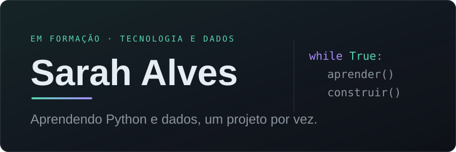
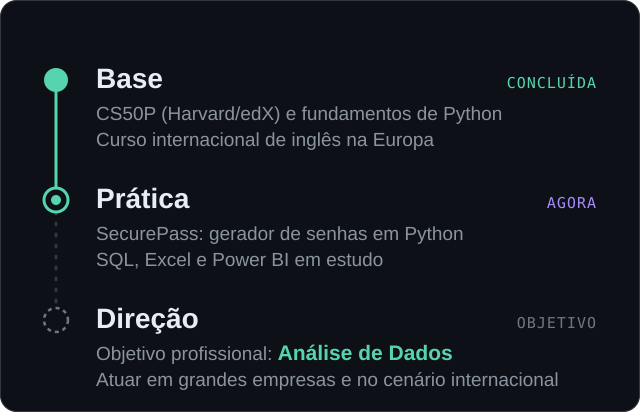

## Sarah Alves

  
  
Sobre mim

Oi, eu sou a Sarah. Estou no começo da minha trajetória em tecnologia e, por enquanto, o que mais faço é aprender e colocar em prática.

Me interesso por desenvolvimento de sistemas, mas o que mais me atrai é Análise de Dados, e é pra lá que quero ir. Já concluí o CS50P (Python, Harvard/edX), tenho um projeto próprio, o SecurePass, e realizei um Curso de Inglês na Europa.

Quero crescer com consistência, chegar a empresas grandes e a oportunidades fora do Brasil. Este perfil é onde eu registro esse caminho.

 
Atualmente
<table width="100%"> <tr> <td width="50%" valign="top"> <strong>Fundamentos de programação</strong>  construir uma base sólida antes de acelerar </td> <td width="50%" valign="top"> <strong>Python</strong>  praticando com projetos próprios </td> </tr> <tr> <td width="50%" valign="top"> <strong>SQL</strong>  consultas e bancos de dados </td> <td width="50%" valign="top"> <strong>Análise de dados</strong>  a área que quero seguir </td> </tr> <tr> <td width="50%" valign="top"> <strong>Construção de projetos</strong>  aprender fazendo, não só assistindo </td> <td width="50%" valign="top"> <strong>Desenvolvimento profissional</strong>  portfólio, inglês e organização </td> </tr> </table>  
Tecnologias
<table width="100%"> <tr> <td width="50%" valign="top"> <strong>NA PRÁTICA</strong>   <code>Python</code> </td> <td width="50%" valign="top"> <strong>EM ESTUDO</strong>   <code>SQL</code> <code>Excel</code> <code>Power BI</code> </td> </tr> </table>  

Minha jornada

  
  
Contato

Se quiser trocar uma ideia sobre Python, dados ou começar em tecnologia, é só chamar.

<a href="https://github.com/Devsarahalves"><strong>GitHub</strong></a>  ·  <a href="https://instagram.com/_sarahsaantos_"><strong>Instagram</strong></a>

  
  

